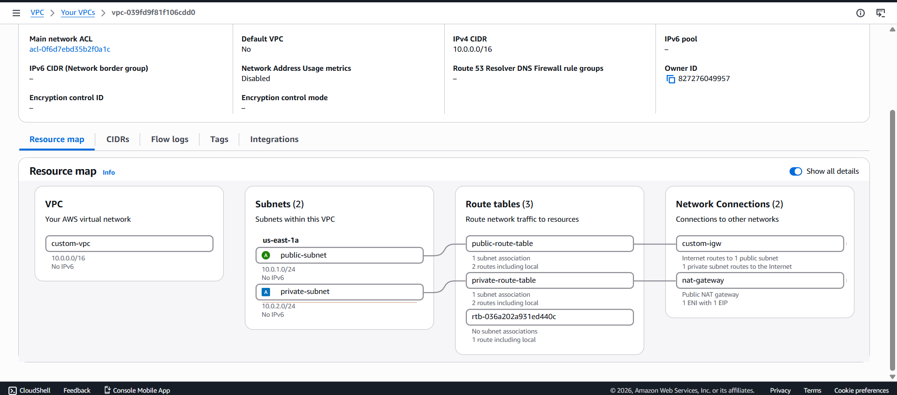

# AWS 2-Tier Architecture using Terraform

## Project Overview

This project provisions a complete **2-Tier Architecture** on AWS using **Terraform**.

The infrastructure consists of:

- Custom VPC
- Public Subnet
- Private Subnet
- Internet Gateway
- NAT Gateway
- Public & Private Route Tables
- Security Groups
- EC2 Web Server (Public Subnet)
- EC2 Application Server (Private Subnet)
- EC2 Database Server (Private Subnet)

The entire infrastructure is created using Infrastructure as Code (IaC) with Terraform.

---

# Architecture



Example:

```
Internet
     │
Internet Gateway
     │
Public Route Table
     │
Public Subnet
┌───────────────────┐
│ Web Server        │
└─────────┬─────────┘
          │
     Private Network
          │
Private Route Table
          │
Private Subnet
┌───────────────────┐
│ App Server        │
│ DB Server         │
└───────────────────┘
```

---

# AWS Services Used

- Amazon VPC
- Amazon EC2
- Internet Gateway
- NAT Gateway
- Elastic IP
- Route Tables
- Security Groups

---

# Project Structure

```
terraform-aws-2-tier-architecture/
│
├── provider.tf
├── variables.tf
├── terraform.tfvars
├── networking.tf
├── security-groups.tf
├── main.tf
├── outputs.tf
└── README.md
```

---

# Infrastructure Components

## Networking

- Custom VPC
- Public Subnet
- Private Subnet
- Internet Gateway
- NAT Gateway
- Elastic IP
- Public Route Table
- Private Route Table

---

## Compute

### Web Server

- Public Subnet
- Public IP Enabled
- Accessible over HTTP/HTTPS

### Application Server

- Private Subnet
- No Public IP
- Accessible only from the Web Server

### Database Server

- Private Subnet
- No Public IP
- Accessible only from the Application Server

---

# Terraform Commands

Initialize Terraform

```bash
terraform init
```

Validate configuration

```bash
terraform validate
```

Preview infrastructure

```bash
terraform plan
```

Provision infrastructure

```bash
terraform apply
```

Destroy infrastructure

```bash
terraform destroy
```

---

# Outputs

After deployment Terraform outputs:

- VPC ID
- Public Subnet ID
- Private Subnet ID
- Web Server Public IP
- Web Server Private IP
- Application Server Private IP
- Database Server Private IP

---

# Learning Objectives

This project demonstrates understanding of:

- Infrastructure as Code (Terraform)
- AWS Networking
- VPC Design
- Public & Private Subnets
- Internet Gateway
- NAT Gateway
- Route Tables
- Security Groups
- EC2 Provisioning
- Private Network Communication

---

# Future Improvements

- Reverse Proxy using Nginx
- Amazon RDS instead of EC2 Database
- Application Load Balancer (ALB)
- Auto Scaling Group (ASG)
- Bastion Host
- Multi-AZ Deployment
- CI/CD using GitHub Actions
- Docker
- Kubernetes (EKS)

---

# Author

**Swaraj Kawade**

Aspiring DevOps Engineer

AWS | Terraform | Linux | Git | GitHub | Docker | Kubernetes